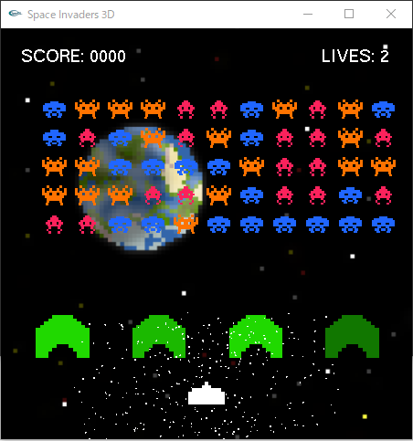
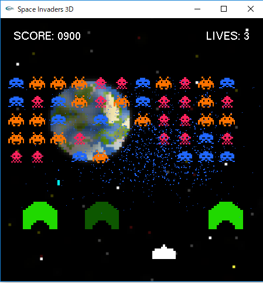
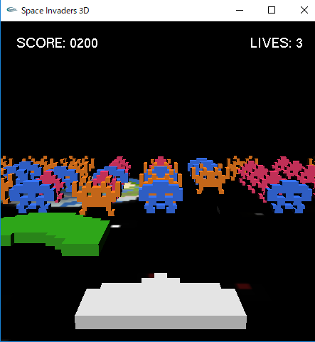
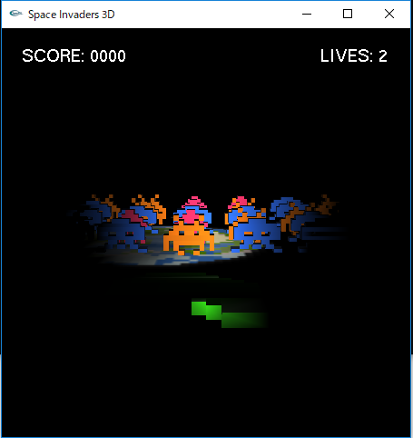

# Space Invaders 3D

This is a recreation of the original Space Invaders written in C++ using OpenGL and GLUT developed in and for Windows with VisualStudio.

A few upgrades were added, such as particle explosions.

A 3D mode.

And lighting, triggering a dark mode option when combined with 3D mode.

